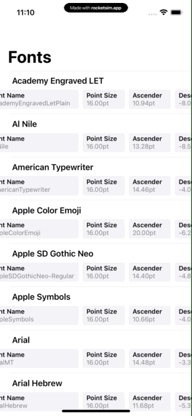

# SwiftUISeries Workarounds & Hacks
My submission for the SwiftUISeries' Workarounds & Hacks challenge

## Problem Description
For a list in an app I'm working on, we wanted to display some key/value attributes for each element, but as there are many attributes to display, we wanted to have them in an horizontal ScrollView. However, we wanted to be able to easily scan and compare values between elements. So we decided to sync all ScrollView's scroll.

I had 2 issues to implement this design:
- I needed to sync all key/values widths in "columns" accross all cells
- I needed to somehow update the contentOffset of underlying UIScrollView as nothing can do that in SwiftUI. ScrollViewReader is too basic and can only scroll to a specific view, not to a precise offset.

## Solution

### Widths Sync
To sync all widths, I used a quite known technique of the GeometryReady to "read" the width of a view. But instead of storing it in a `@State`, I store it in a key:width dictionary inside a `ObservableObject` named `WidthsStore`.

All of this is done in a single `syncWidth(key:)` View operator that adds a `ViewModifier` responsible to get the `WidthsStore`, read the width, add it to the store, and get it back whenever it is updated to use it as a `minWidth`.

### Scroll Sync
For this one, I decided to hookup in the UIKit hierarchy to find the closes `UIScrollView` with a technique similar to what **[Introspect](https://github.com/siteline/SwiftUI-Introspect)** does, by injecting a hidden `UIViewController`/`UIViewControllerRepresentable` that is only responsible of calling a given closure on specific events (e.g. viewDidAppear).

Once I've found the closest `UIScrollView`, I "register" in a shared environment object and setup some Rx bindings. I love to use RxCocoa for this kind of hacks because it allows me to listen tons of events without having to manually swap delegates or subsclass anything. It is especially helpful in SwiftUI where we can't subclass underlying classes.

Registered UIScrollView will report their `contentOffset` whenever it changed following a user interaction (`isDragging`). Other UIScrollView will listen this change and update their own `contentOffset` to keep it synced with other's.

 
